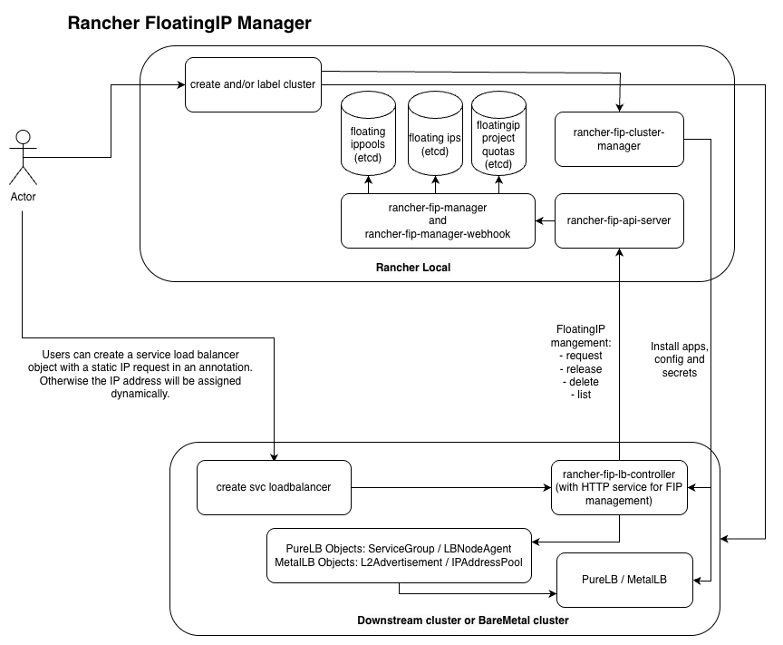

# Rancher FloatingIP Manager

## Overview

Rancher FloatingIP Manager is a Kubernetes controller designed to manage the lifecycle of Floating IPs (FIPs) within a Kubernetes environment. It provides a declarative API for allocating and managing FIPs from predefined pools and keeps track off project-based quotas.

This controller introduces three Custom Resource Definitions (CRDs):
- **`FloatingIPPool`**: A cluster-scoped resource that defines a pool of available IPv4 and/or IPv6 addresses.
- **`FloatingIPProjectQuota`**: A cluster-scoped resource that defines FIP quotas for a specific project.
- **`FloatingIP`**: A namespaced resource that represents a request for a specific floating IP to be assigned to a service.

The controller runs with high availability using a leader election mechanism, ensuring that only one instance is active at any time.

## Features

-   **Declarative IP Management**: Manage floating IPs as Kubernetes objects.
-   **IP Pooling**: Define pools of IPv4 and IPv6 addresses available for allocation.
-   **Project Quotas**: Keep track of the configured and used number of FIPs a project is consuming from each pool. This is not checked or enforced.
-   **Automatic Allocation**: Automatically assign an available IP if one is not specified in the `FloatingIP` request.
-   **High Availability**: Employs a leader election pattern for fault tolerance.
-   **Status Reporting**: Updates the status of all CRs to reflect the current state of IP allocations and usage.

## How does the rancher-fip-manager work?

When a user creates a downstream or bare-metal cluster in Rancher, the rancher-fip-cluster-manager detects it and checks for the cluster object label `rancher-fip` and optionally for the label `rancher-fip-lbtype`.
If the `rancher-fip` label exists and is set to `enabled`, the manager creates the necessary API configurations and secrets, then installs the rancher-fip-lb-controller and the specified load balancer type (PureLB or MetalLB) Helm charts in the new cluster. If no load balancer type is specified, PureLB is selected as the default.

When the user later creates a Service LoadBalancer object within that cluster, the rancher-fip-lb-controller detects it and requests an IP address from the rancher-fip-api-server.
The API server attempts to create a FloatingIP object, which is validated by the rancher-fip-manager-webhook to ensure the request is allowed, correctly configured, and within the FloatingIPProjectQuota limits.

If approved, the IP details are returned to the rancher-fip-lb-controller, which then creates the PureLB or MetalLB objects. These are processed by the applicable controllers, which assign the IP address to the Service LoadBalancer.



## Getting Started

### Prerequisites

-   Go (version 1.25.3)
-   Docker
-   `kubectl`
-   A running Kubernetes cluster (e.g., kind, minikube, or a cloud provider)

### Installation

1.  **Install CRDs**:
    Apply the Custom Resource Definition manifests to your cluster.
    ```sh
    kubectl apply -f config/crd/
    ```

2.  **Build the Controller**:
    ```sh
    go build -o bin/manager cmd/manager/main.go
    ```

3.  **Run Locally**:
    For development, you can run the controller outside the cluster. Ensure your `KUBECONFIG` environment variable is set correctly.
    ```sh
    export KUBECONFIG=~/.kube/config
    ./bin/manager --leader-elect=true
    ```

4.  **Deploy to Cluster**:
    Build and push the container image, then apply the deployment manifests.
    First, build and push your container image to a registry accessible by your cluster.
    ```sh
    export IMG=your-registry/rancher-fip-manager:latest
    make docker-build IMG=${IMG}
    docker push ${IMG}
    ```

    Next, update the image name in the deployment manifest:
    ```sh
    # Edit config/deployment/deployment.yaml and set the `spec.template.spec.containers[0].image` field to ${IMG}
    ```

    Finally, deploy the controller and its RBAC configuration:
    ```sh
    make deploy
    ```

## Usage Example

1.  **Create a Project**:
    First, create a `FloatingIPProjectQuota` to define quotas for a project.
    ```yaml
    # config/samples/floatingipprojectquota.yaml
    apiVersion: rancher.k8s.binbash.org/v1beta1
    kind: FloatingIPProjectQuota
    metadata:
      name: my-project
    spec:
      displayName: "My Awesome Project"
      floatingIPQuota:
        "prod-v4-pool": 10
    ```
    ```sh
    kubectl apply -f config/samples/floatingipprojectquota.yaml
    ```

2.  **Create an IP Pool**:
    Define a pool of IPs.
    ```yaml
    # config/samples/pool.yaml
    apiVersion: rancher.k8s.binbash.org/v1beta1
    kind: FloatingIPPool
    metadata:
      name: prod-v4-pool
    spec:
      ipConfig:
        family: "IPv4"
        subnet: "192.168.100.0/24"
        pool:
          start: "192.168.100.10"
          end: "192.168.100.20"
    ```
    ```sh
    kubectl apply -f config/samples/pool.yaml
    ```

3.  **Create a Namespace for the Project**:
    Create a namespace for your project.
    ```sh
    kubectl create namespace my-project-ns
    ```

4.  **Request a Floating IP**:
    Create a `FloatingIP` resource in the project's namespace. Make sure to add the `rancher.k8s.binbash.org/project-name` label to the `FloatingIP` resource itself.
    ```yaml
    # config/samples/fip.yaml
    apiVersion: rancher.k8s.binbash.org/v1beta1
    kind: FloatingIP
    metadata:
      name: my-app-fip
      namespace: my-project-ns
      labels:
        rancher.k8s.binbash.org/project-name: my-project
    spec:
      floatingIPPool: prod-v4-pool
    ```
    ```sh
    kubectl apply -f config/samples/fip.yaml
    ```

5.  **Check the Status**:
    The controller will allocate an IP and update the status of all resources.
    ```sh
    kubectl get floatingip -n my-project-ns my-app-fip -o yaml
    kubectl get floatingippool prod-v4-pool -o yaml
    kubectl get floatingipprojectquota my-project -o yaml
    ```

## Metrics

The following metrics are included in the application which can be used for monitoring:

```YAML
Name: rancherfipmanager_floatingipprojectquota_created
Description: Object creation timestamp.
```

```YAML
Name: rancherfipmanager_floatingipprojectquota
Description: Quota information per project.
```

```YAML
Name: rancherfipmanager_floatingips
Description: Information about floating IPs.
```

```YAML
Name: rancherfipmanager_ippool_capacity
Description: Total IPs in the pool.
```

```YAML
Name: rancherfipmanager_ippool_available
Description: Available IPs in the pool.
```

```YAML
Name: rancherfipmanager_ippool_used
Description: Used IPs in the pool.
```

Metrics are exported on port 8080 by default via the /metrics path. This can be changed by adding the http-service-port flag as an argument in the deployment. The deployment example also contains a servicemonitor object which can be automatically picked up by the Prometheus monitoring solution.

# License

Copyright (c) 2026 Joey Loman <joey@binbash.org>

Licensed under the Apache License, Version 2.0 (the "License");
you may not use this file except in compliance with the License.
You may obtain a copy of the License at

[http://www.apache.org/licenses/LICENSE-2.0](http://www.apache.org/licenses/LICENSE-2.0)

Unless required by applicable law or agreed to in writing, software
distributed under the License is distributed on an "AS IS" BASIS,
WITHOUT WARRANTIES OR CONDITIONS OF ANY KIND, either express or implied.
See the License for the specific language governing permissions and
limitations under the License.